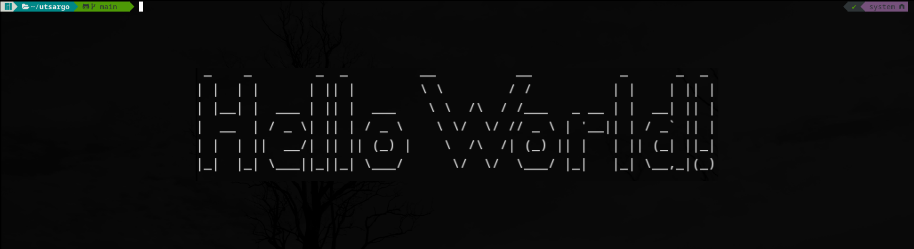

<h1 align='center'>Hi, I am Utsargo</h1>

[](https://www.linkedin.com/in/utsargo-roy/)

### A little bit about me

```javascript
const utsargoRoy = {
  lookingFor: "Front-end developer" || "Full-stack web developer",
  pronouns: ["he", "him"],
  stack: [JavaScript, React, Redux, Python, Ruby on Rails, HTML/CSS, Semantic UI, Bootstrap, Material UI],
  hobbies: [Theatre, Recitation, Poetry],
}
```

<!--
**utsargo/utsargo** is a ✨ _special_ ✨ repository because its `README.md` (this file) appears on your GitHub profile.

Here are some ideas to get you started:

- 🔭 I’m currently working on ...
- 🌱 I’m currently learning ...
- 👯 I’m looking to collaborate on ...
- 🤔 I’m looking for help with ...
- 💬 Ask me about ...
- 📫 How to reach me: ...
- 😄 Pronouns: ...
- ⚡ Fun fact: ...
-->
